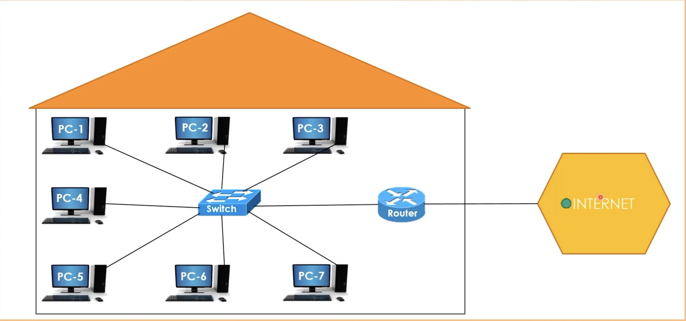

# What is the router?

### Link
https://www.youtube.com/watch?v=zN8YNNHcaZc&t=796s

### Router
 - The main task of a router is to enable computers to connect to the internet
 - A special cable comes to a place to connect to the internet is **ISP(Internet Service Provider)**
 - There's no need for a router for devices in the same LAN to communicate
 - The device that delivers the packets from the LAN to the internet is the router

### Connecting to the internet
 - If a device can send packets to the internet, this means that the device can connect to the internet without any problem
 - Device -> Switch -> Router -> Internet

### Image
