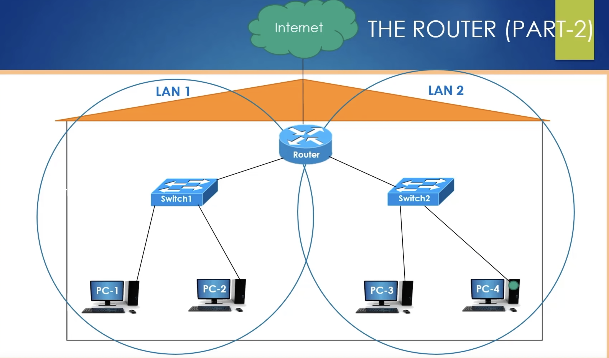

# CAN(Campus Area Network)

### Link
https://www.youtube.com/watch?v=zN8YNNHcaZc&t=4202s

### CAN(Campus Area Network)
 - LANs connected by switches yet in the different location(needs to be close to each other)
   - This is eventually more secure than VPN
 -  If routers has special connection closed to each other(Dedicated Line) is called **Private WAN**
 -  The main task of the router is to connect different networks. The location of these network doesn't matter

### Image
