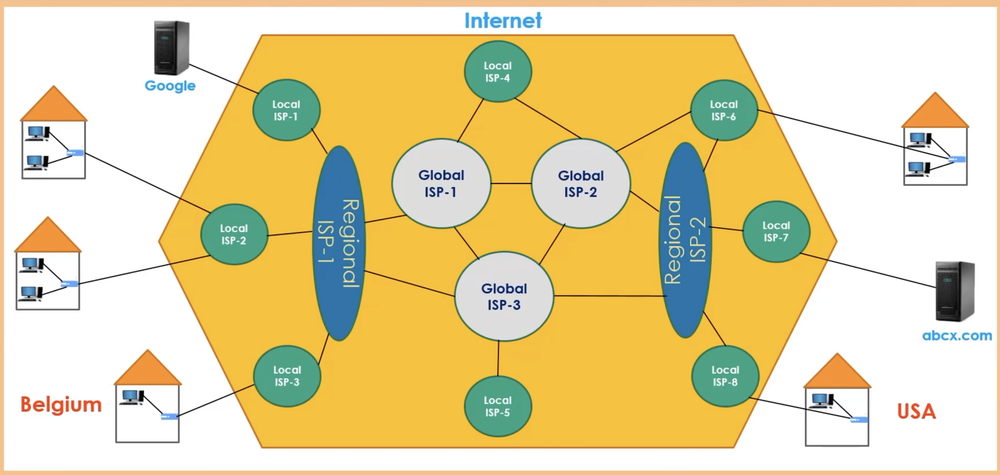

# ISP(Internet Service Provider)

### Link
https://www.youtube.com/watch?v=zN8YNNHcaZc&t=4646s

### ISP
 - Routers distributed around the world is controlled by ISPs
 - Each ISP is responsible for specific routers that communicates with other routers
 - ISPs represent companies that enable us to connect to the internet for money

### Local ISP
 - It is basically responsible for smaller areas
   - e.g. neighborhood etc.
 - Small ISP offices are called as **Point of Presence(POP)**
 - Packet travel through several ISPs to reach the destination.

### Regional ISP
 - It is responsible for bigger areas than local ISP
   - e.g. Cities, Villages etc.
 - Network of a country = Local ISPs + Regional IPSs

### Global ISP
 - It is the ISP that connects different countries
 - When packet is sent, each router in Regional SPI makes a choice and the result of all these choices determines on which Global ISP the packet will be sent
   - Packets can take a different route each time

### How response / request work
 - When packet is sent to some service's server it sends back a response depending on a request
   - the response can be in shape of images, videos, links, HTML files etc

### Peering
 - In some mega companies such as google, it connects its server with local ISP to make the connection much faster/stable
   - Because the packet go through less POPs, the security is better

### Internet Exchange Point(IXP)
 - It's the structure that enables the **Internet Backbone** to work synchronously
   - **Internet Backbone** is Global ISPs set up each other to communicate

### Eligibility of ISPs
 - Users can get service from any ISP serving the users' locations.
   - Like directory connecting to Regional/Global ISP

### Image
