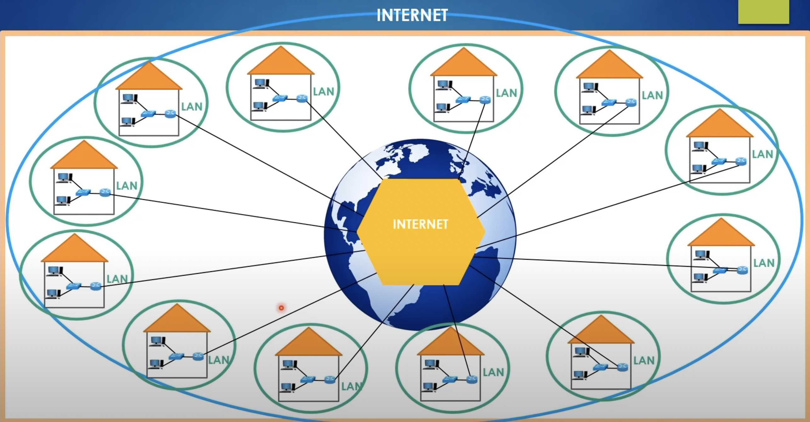

# What is the Routing Table?

### Link
https://www.youtube.com/watch?v=zN8YNNHcaZc&t=2127s

### Routing table
 - Each router must have a special table called **Routing table**
   - This table tells us which route the packet should choose in order to reach the destination
  - The router learns the packet's destination then it looks at the routing table and learns over which port the packet will be sent
    - This is called **Forwarding**
 - A router always wants to deliver the packet to its destination in the fastest way possible
 - Everything above is done in milliseconds

### What is internet(part2)
 - All of those pieces of LANs networks is called **internet**
    - The internet is a huge system that includes all the LANs around the world

### Internet Image

