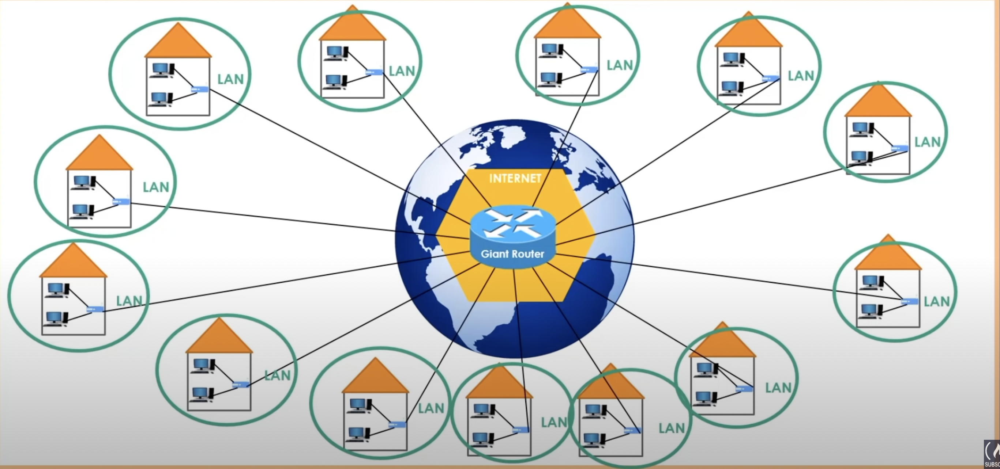

# What is the router?

### Link
https://www.youtube.com/watch?v=zN8YNNHcaZc&t=1183s

### What is internet
 - The internet is the network of networks
 - Connecting to the internet can stand for connecting to the another computer in anywhere in the world
    - Thus, The structure that connects all LANs in the world is the internet
 - A home-router is a combo device that is a mixture of router and switch
   - Most home-routers now a nowadays also have an access point feature. In this way, you can use wireless technology as well,

### Why routers are distributed around the world 
 - IF we give entire the load to the single point, it's called **Single Point of Failure**
   - In such architecture, LANs need super long cables which is unrealistic

### Single Point Failure

