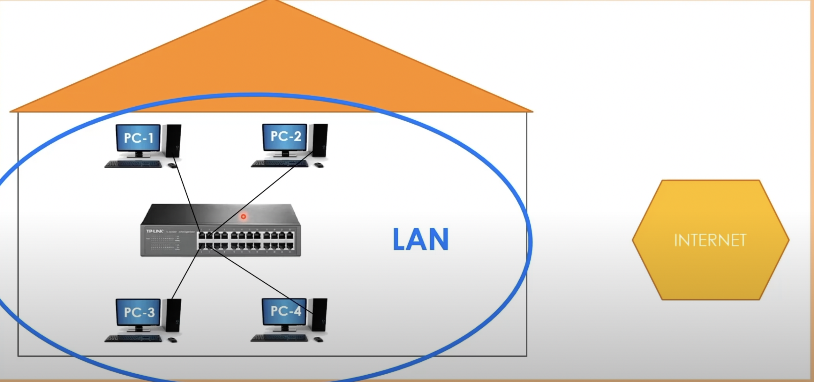

# What is the switch and why do we need?

**CAT cable = Category cable**
- The cable to connect devices physically with Switch.
  - Like PS5 to Router
- Fiber optic cables are much faster than copper cables in general.

**Switch device**
 - The physical device that connects devices
 - A switch cannot use wireless technology like wifi
 - In order to connect devices in the same environment to be connected each other over wireless technology, **Access point** needs to be used

**LAN**
 - When several devices are connected by switch, there's a local area network. In short form it's called **LAN**
 - LAN is a computer network that connects computers within restricted area.
   - e.g. residence, shool, office building etc.

**Packet/Frame**
 - The message generated by a computer towards switch/another computer

### Image
